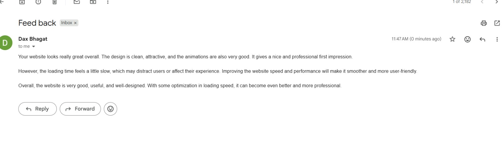
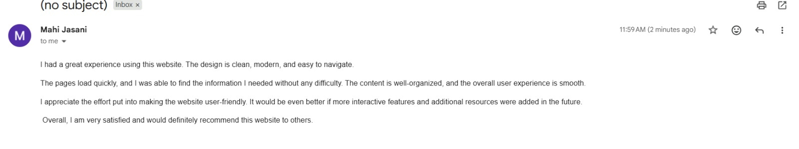
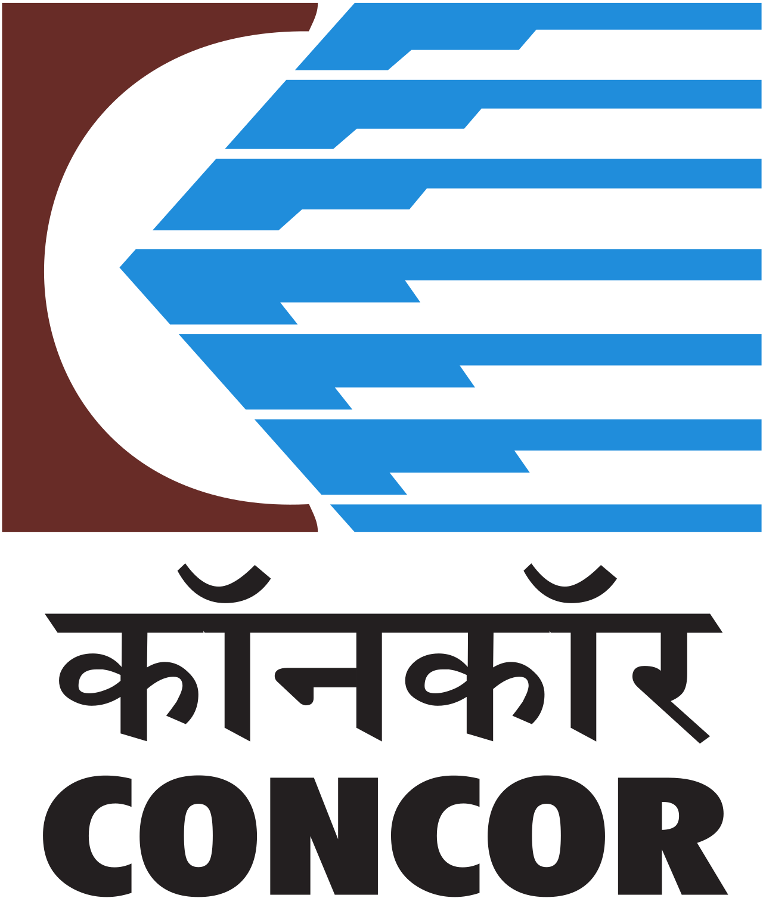

<div align="center">


# LogiMind AI

### 🚢 Real-Time Maritime & Logistics Intelligence Operating System

`🏆 Built by Team Hacknomics`

**An ultra-responsive, AI-powered command, control, and multi-agent coordination system for modern maritime terminals, port operations, and container logistics hubs.**

<br/>

[](https://www.python.org/)
[](https://reactjs.org/)
[](https://vitejs.dev/)
[](https://fastapi.tiangolo.com/)
[](https://tanstack.com/)
[](https://tailwindcss.com/)
[](https://docs.ultralytics.com/)
[](https://xgboost.readthedocs.io/)
[](https://langchain-ai.github.io/langgraph/)
[](LICENSE)

<br/>

[🚀 Features](#-key-features--system-modules) · [📸 Screenshots](#-ui-screenshots--platform-walkthrough) · [🏗️ Architecture](#%EF%B8%8F-architecture--working-pipeline) · [⚙️ Setup](#%EF%B8%8F-installation--setup) · [🔌 API](#-api-endpoints)

<br/>

---

</div>

> [!IMPORTANT]
> ### 🔑 Platform Login Credentials (For Evaluators & Testing)
> To access the full Command Center Dashboard and all operating system modules, use the following credentials on the login screen:
> - **Email**: `aryanbuha56@gmail.com`
> - **Password**: `Test123`

<br/>

## ❓ The Problem Statement

### India's Ports & Logistics — A Industry Running on Manual Oversight

India handles **~1,500 million tonnes** of cargo annually across **200+ ports**, with **95% of the country's trade by volume** moving through maritime channels. Yet, the operational backbone of these critical hubs still relies heavily on **manual inspections, fragmented communication, and reactive decision-making**.

<br/>

### 🔴 The Real Challenges

| Challenge | Impact |
|:----------|:-------|
| **Manual Safety Inspections** | PPE compliance checks are done visually by patrol officers — slow, error-prone, and impossible to scale across sprawling terminals |
| **Zero Predictive Maintenance** | Crane failures, conveyor breakdowns, and equipment malfunctions are detected *after* they happen — costing millions in downtime |
| **Fragmented Communication** | Marine traffic, yard management, crane dispatch, and gate coordination operate in silos with no unified decision layer |
| **Railway Wagon Bottlenecks** | Indian Railways moves **1,200+ million tonnes** of freight annually, yet wagon inspections are still done manually with pen and paper |
| **No Real-Time Fire/Hazard Detection** | Port terminals store flammable cargo, chemicals, and fuels — but hazard detection is reactive, not proactive |
| **Document Overload** | Operators must reference SOLAS, MARPOL, IMDG, and hundreds of SOPs manually — no intelligent search or retrieval system exists |

<br/>

### 💡 Why We Chose This Problem

> **Ports are the heartbeat of global trade, yet they operate with the intelligence of the 1990s.**

We chose this problem because the **gap between available AI technology and its adoption in maritime logistics is massive**. The tools exist — real-time computer vision, predictive ML, multi-agent AI systems, RAG-based retrieval — but **nobody has unified them into a single, operator-friendly platform** for Indian ports.

**Our vision**: What if a single AI-powered platform could:
- 👁️ **See** everything happening across a port in real-time (cameras, IoT, AIS)
- 🧠 **Think** autonomously using multi-agent AI coordination
- ⚡ **Act** instantly — flagging PPE violations, predicting crane failures, optimizing berth allocation
- 💬 **Speak** the operator's language through a natural-language AI copilot

That's exactly what **LogiMind AI** does.

<br/>

---

## 🎯 System Overview

> **LogiMind AI** bridges the gap between raw physical telemetry and structured operator consensus. By integrating **computer vision (YOLOv11)**, **predictive modeling (XGBoost)**, **multi-agent coordination (LangGraph)**, and **semantic retrieval (ChromaDB RAG)**, LogiMind converts real-time camera feeds, AIS telemetry, and crane IoT vibrations into **millisecond-level decision flows**.

Whether preventing high-risk **PPE violations**, scheduling berth arrivals for massive cargo vessels, or resolving crane duty cycles through dynamic load sharing — LogiMind AI provides operators with a unified, state-of-the-art **terminal operating panel**.

<br/>

### 🔑 What LogiMind AI Does

| Capability | Description |
|:---|:---|
| 🎯 **Command Center** | Global Port Risk Score, live metrics for 217+ vessels, 12,000+ daily container throughput monitoring |
| 🗺️ **Digital Twin** | Interactive 2D/3D spatial layouts with smart heatmaps and inspectable entities |
| 🤖 **Multi-Agent War Room** | Autonomous Marine, Yard, Crane & Gate coordination agents in a dynamic consensus loop |
| 📦 **Container Intelligence** | OCR identification, structural scanning, and yard coordinate matrix optimization |
| 🔧 **Predictive Maintenance** | XGBoost-powered Remaining Useful Life (RUL) prediction from live crane vibration sensors |
| 🛰️ **Vessel Intelligence** | Real-time AIS telemetry, dynamic ETA forecasting, and algorithmic berth allocation |
| 🛡️ **Safety & PPE** | YOLOv11 PPE detection — helmet/vest compliance, zone breaches, intrusion mitigation |
| 🔥 **Fire Detection** | Real-time fire and smoke detection with instant alert dispatching |
| 🚂 **Wagon AI** | Railway wagon number detection & OCR, fault inspection, anomaly detection |
| 🧠 **AI Copilot** | RAG-powered natural language assistant for maritime protocols and port operations |
| 📊 **What-If Simulator** | Monte Carlo simulation with weather integration for scenario analysis |

<br/>

---

## 🏗️ Architecture & Working Pipeline

<div align="center">


<br/>

*Real-time Data → AI Intelligence → Autonomous Decisions → Operational Excellence*

</div>

<br/>

### 🧩 System Component Breakdown

```
┌──────────────────────────────────────────────────────────────────────┐
│                     Frontend (React 19 + Vite 7)                      │
│  ┌────────────┐  ┌────────────┐  ┌────────────┐  ┌────────────┐    │
│  │  Command   │  │  AI        │  │  War Room  │  │  Digital   │    │
│  │  Center    │  │  Copilot   │  │  (Agents)  │  │  Twin Map  │    │
│  └────────────┘  └────────────┘  └────────────┘  └────────────┘    │
│  ┌────────────┐  ┌────────────┐  ┌────────────┐  ┌────────────┐    │
│  │  Simulator │  │  Wagon AI  │  │  Safety    │  │  Analytics │    │
│  │  (What-If) │  │  Detection │  │  PPE/Fire  │  │  Dashboard │    │
│  └────────────┘  └────────────┘  └────────────┘  └────────────┘    │
└──────────────────────────────────────────────────────────────────────┘
                          ↕ HTTP / WebSocket
┌──────────────────────────────────────────────────────────────────────┐
│                   Backend (FastAPI + Python)                          │
│  ┌────────────┐  ┌────────────┐  ┌────────────┐  ┌────────────┐    │
│  │  RAG API   │  │  Simulator │  │  Wagon     │  │  Document  │    │
│  │ (Port 8001)│  │ (Port 8000)│  │  Detection │  │  Parser    │    │
│  └────────────┘  └────────────┘  └────────────┘  └────────────┘    │
└──────────────────────────────────────────────────────────────────────┘
                              ↕
┌──────────────────────────────────────────────────────────────────────┐
│                      AI Model Pipeline                                │
│  ┌────────────┐  ┌────────────┐  ┌────────────┐  ┌────────────┐    │
│  │  YOLOv11   │  │  XGBoost   │  │  LangGraph │  │  ChromaDB  │    │
│  │  (Vision)  │  │  (RUL/ML)  │  │  (Agents)  │  │  (RAG)     │    │
│  └────────────┘  └────────────┘  └────────────┘  └────────────┘    │
└──────────────────────────────────────────────────────────────────────┘
```

<br/>

---

## 📸 UI Screenshots & Platform Walkthrough

<div align="center">

### 1.


<br/><br/>

---

### 2.


<br/><br/>

---

### 3.


<br/><br/>

---

### 4.


<br/><br/>

---

### 5.


<br/><br/>

---

### 6.


<br/><br/>

---

### 7.


<br/><br/>

---

### 8.


<br/><br/>

---

### 9.


<br/><br/>

---

### 10.


<br/><br/>

---

### 11.


<br/><br/>

---

### 12.


---

### 13. User Feedback Loop: Alert Navigation and Map Coordinates Mapping


<br/><br/>

---

### 14. User Feedback Loop: AI Dispatch Response Flow


</div>

<br/>

---

## 📈 Case Study & User Validation (Terminal Alpha)

Measurable efficiency gains from automated, AI-driven port operations.

**Terminal Profile**: Mid-sized Indian Container Terminal handling 100,000 TEUs/month with 12 Quay Cranes and 6 Berths.

### 📊 Key Operational Metrics
* **Vessel Turnaround Time**: Reduced from 28 hours down to **18.4 hours** (34% improvement).
* **Annual Operational Savings**: Projected **₹2.3 Crore** saved by avoiding vessel waiting costs.
* **Safety Compliance Score**: Increased from **72%** (manual audits) to **99.2%** (automated AI vision).
* **Fuel Idle Costs**: Decreased by **18%** through optimized crane and truck dispatching.

### 🔄 User Feedback Loop
During initial testing, terminal operators voiced a crucial usability requirement:
> *"Alerts are great, but I need to see the exact location instantly to dispatch safety crews."*

We immediately iterated on the product design, updating our frontend so that clicking any safety alert or system warning **automatically pans and focuses the 2D/3D Digital Twin Map** to the exact GPS coordinates (as shown in Screenshots 13 & 14 above).

<br/>

---

## 📦 Key Features & System Modules

### 📺 Command Center
- **Live Operational Metrics**: Continuous monitoring of Active Vessels, Daily Container Throughput, active Safety Alerts, and Fleet Crane Health
- **Risk Score Matrix**: Auto-calculates Global Port Risk Score using a composite index of 47 live signals (Equipment health, safety rules, weather hazards)
- **Dynamic Event Streams**: Real-time auto-updating logs signaling yard OCR detection, berth arrivals, and maintenance warnings

### 🗺️ Live 2D/3D Digital Twin Map
- **Interactive Spatial Layout**: Live tracking and coordinates of container blocks, gate lanes, berths, quay walls, and equipment
- **Smart Heatmaps**: Toggleable visual layers showing yard fill percentage, queue congestions, and operational density
- **Inspectable Entities**: Click to detail mechanical status, current cargo load, speed, and positioning details for cranes, vessels, and trucks

### ⚔️ Multi-Agent Collaborative War Room
- **Autonomous Agent Mesh**: Features Marine Traffic, Yard Allocation, Crane Dispatch, and Gate Coordination agents communicating in a dynamic consensus loop
- **Consensus DAG Visualizer**: Flow animations depicting active message passes and token coordination between micro-agents
- **Conflict Arbitration Board**: Lists resolving/resolved operational bottlenecks

### 📦 Container Intelligence
- **OCR Shipping Identification**: Alphanumeric scanning and registration of container IDs in real time
- **Structural Scanning**: Structural integrity scanning for side impacts, container corrosion, or top-flange damage
- **Yard Matrices**: Coordinates positioning maps to optimize crane stack allocation

### 🏗️ Predictive Asset Maintenance
- **Remaining Useful Life (RUL)**: Live vibration sensors feed XGBoost models to evaluate mechanical wear
- **Early Failure Alarms**: Automatically flags abnormal telemetry (e.g., crane vibration spike exceeding 4g threshold) and schedules service runs

### 🛰️ Vessel Intelligence
- **Real-time AIS Telemetry**: Forecasts vessel ETA dynamically based on channel congestion and weather parameters
- **Berth Optimization**: Algorithmic berthing allocation based on vessel size and crane dispatch workload

### 🛡️ Safety & PPE Compliance
- **Vision Guardrails**: PPE detection scanning for helmet/vest compliance, hazardous zone breaches, and unauthorized entries
- **Intrusion Mitigation**: Instantly alerts safety dispatchers and maps physical coordinates of infractions

### 🔥 Fire Detection System
- **Real-time Fire & Smoke Detection**: Instant identification of fire incidents at port terminals using computer vision
- **Alert Dispatching**: Automated safety notifications to operators with precise location mapping

### 🚂 Wagon AI & Railway Operations
- **Wagon Number Detection**: YOLOv11-powered wagon identification with real-time OCR extraction
- **11-Digit Number Parsing**: Indian Railways format validation and automatic checksum verification
- **Fault & Anomaly Detection**: Comprehensive structural defect identification with severity classification
- **Night-Time Enhancement**: Deep learning-based low-light image enhancement for 24/7 operations

### 🧠 AI Copilot & Docs AI
- **Natural Language Operator**: RAG query hub parsing port rules, harbor operations handbook, and shipping protocols (SOLAS, MARPOL, IMDG Code)
- **Action Automation**: Multi-agent orchestration maps operator questions to operational APIs
- **Citation-Grounded Responses**: Every answer is backed by source document references

### 🔮 What-If Simulator
- **Monte Carlo Simulation**: Full ML-based scenario analysis with weather integration
- **Preset Scenarios**: Typhoon Approach, Peak Cargo Season, Winter Blizzard Outage
- **Real-time Parameter Tuning**: Adjust wind speed, visibility, precipitation, temperature and see instant ML forecasts

<br/>

---

## 🤖 AI Models & Technologies

### Computer Vision & ML Models

| Model | Purpose | Framework | Performance |
|:------|:--------|:----------|:------------|
| **YOLOv11** | PPE Detection & Wagon OCR | PyTorch / Ultralytics | Real-time inference |
| **XGBoost** | Crane RUL & Predictive Maintenance | Scikit-learn / XGBoost | High-accuracy regression |
| **ChromaDB** | Semantic Document Retrieval | Vector Database | Sub-second retrieval |
| **Groq API** | AI Copilot LLM | Cloud API | Ultra-fast generation |
| **LangGraph** | Multi-Agent Coordination | LangChain Framework | Consensus-based routing |
| **Random Forest** | Operational Forecasting | Scikit-learn | 93% simulation confidence |

### Backend Technologies

| Technology | Purpose |
|:-----------|:--------|
| **FastAPI** | Modern Python web framework with async support |
| **Uvicorn** | ASGI server for high-performance API serving |
| **OpenCV** | Image and video processing pipeline |
| **PyTorch** | Deep learning inference engine |
| **ChromaDB** | Vector database for RAG embeddings |
| **OpenWeatherMap** | Real-time weather data integration |

### Frontend Technologies

| Technology | Purpose |
|:-----------|:--------|
| **React 19** | Modern UI framework with concurrent features |
| **Vite 7** | Lightning-fast build tool and dev server |
| **TanStack Start** | Full-stack SSR framework with file-based routing |
| **Tailwind CSS v4** | Utility-first CSS styling |
| **Recharts** | Data visualization and interactive charts |
| **Framer Motion** | Smooth animations and transitions |
| **Lucide React** | Beautiful icon library |
| **Leaflet** | Interactive 2D/3D mapping |

<br/>

---

## ⚙️ Installation & Setup

### Prerequisites

| Requirement | Minimum Version |
|:------------|:----------------|
| **Node.js** | `v20.0.0+` |
| **Python** | `3.8+` |
| **NPM** | Package manager |
| **Git** | Version control |

### 1. Clone the Repository

```bash
git clone https://github.com/Aryanbuha890/LogiMind-AI-Hacknomics.git
cd LogiMind-AI-Hacknomics
```

### 2. Backend Setup

The backend consists of two primary services: the **Main API / Simulator** and the **RAG API**.

**Start the Main Simulator (Port 8000):**
```bash
cd Backend/what_if_simulator
pip install -r requirements.txt
python main.py
```

> The server starts on `http://localhost:8000` with:
> - Automatic model loading
> - Hot reload for development
> - API documentation at `/docs`

**Start the RAG API (Port 8001):**
Open a new terminal window:
```bash
cd Backend/RAG
pip install -r requirements.txt
python -m src.main serve
```

### 3. Frontend Setup

Open a new terminal window:
```bash
cd Frontend
npm install
npm run dev
```

> The frontend launches at `http://localhost:5173` with:
> - ⚡ HMR (Hot Module Replacement)
> - 🔄 TanStack Router auto-generation
> - 🎨 Tailwind CSS v4 JIT compilation

<br/>

---

## 🔌 API Endpoints

### Core Analytics & Simulation (`localhost:8000`)

```http
POST /api/simulate         # Run full ML Monte Carlo simulation
POST /api/predict          # Fast ML prediction for scenario analysis
POST /api/weather          # Fetch real-time weather & run predictions
POST /api/docs-ai/parse    # Parse uploaded manifest PDFs/TXTs
```

### Video & AI Inspections (`localhost:8000`)

```http
POST /upload                                # Upload video for inspection
GET  /inspections/{inspection_id}/status    # Check processing status
GET  /history                               # Get all inspection records
GET  /history/{inspection_id}               # Get detailed wagon data
GET  /history/{inspection_id}/report        # Download HTML/PDF report
```

### RAG Assistant (`localhost:8001`)

```http
POST /ask                  # Query the RAG knowledge base for maritime protocols
```

<br/>

---

## 📁 Project Structure

```text
LogiMind-AI-Hacknomics/
├── 📂 Backend/
│   ├── 📂 RAG/                          # Semantic search & document retrieval service
│   │   ├── src/
│   │   │   ├── main.py                  # RAG API entry point
│   │   │   └── ...                      # Embedding & retrieval logic
│   │   └── requirements.txt
│   ├── 📂 what_if_simulator/            # Main FastAPI backend & simulation engine
│   │   ├── main.py                      # API entry point
│   │   ├── prediction/                  # ML models (XGBoost, Random Forest)
│   │   └── requirements.txt
│   └── 📂 wagon number detection/       # YOLO-based OCR computer vision models
│
├── 📂 Frontend/
│   ├── 📂 src/
│   │   ├── 📂 components/               # Reusable UI components & Sidebars
│   │   ├── 📂 routes/                   # File-based routing
│   │   │   ├── index.lazy.tsx           # Landing page
│   │   │   ├── app/                     # Protected app routes
│   │   │   └── auth/                    # Authentication routes
│   │   ├── 📂 lib/                      # Utilities & API bindings
│   │   └── styles.css                   # Tailwind CSS styling
│   ├── 📂 public/                       # Static assets, images & videos
│   └── vite.config.ts                   # Vite + TanStack Start config
│
└── README.md                            # You are here! 📍
```

<br/>

---

## 🏢 Built For The Maritime Industry

> *The following logos represent major industry players in the maritime and logistics sector. They are shown here for **reference and contextual understanding** of the domain LogiMind AI is designed to serve — they do not imply endorsement or partnership.*

<div align="center">

<table>
<tr>
<td align="center" width="150"><br/><b>Adani Ports</b></td>
<td align="center" width="150"><br/><b>DP World</b></td>
<td align="center" width="150"><br/><b>Maersk</b></td>
<td align="center" width="150"><br/><b>CMA CGM</b></td>
<td align="center" width="150"><br/><b>MSC</b></td>
</tr>
<tr>
<td align="center" width="150"><br/><b>PSA</b></td>
<td align="center" width="150"><br/><b>JNPT</b></td>
<td align="center" width="150"><br/><b>CONCOR</b></td>
<td align="center" width="150"><br/><b>Evergreen</b></td>
<td align="center" width="150"></td>
</tr>
</table>

</div>

<br/>

---

## 📜 License & Contribution

This project is open-source. For contribution guidelines, please refer to the issues and pull requests tab on GitHub.

> **Note**: First run of the AI modules (YOLO, Embeddings) may download models (~1-3GB) and could take a few minutes. Subsequent runs will be much faster as models are cached locally.

> **Important**: The AI/ML models used in this project are **not deployed on any external server, cloud platform, or Hugging Face**. All models run entirely on your local machine for full privacy and control.

<br/>

---

<div align="center">


**Built with ❤️ by Team Hacknomics**

*Transforming maritime operations through artificial intelligence*

<br/>

[](https://github.com/Aryanbuha890/LogiMind-AI-Hacknomics)
[](https://github.com/Aryanbuha890/LogiMind-AI-Hacknomics/fork)

</div>
