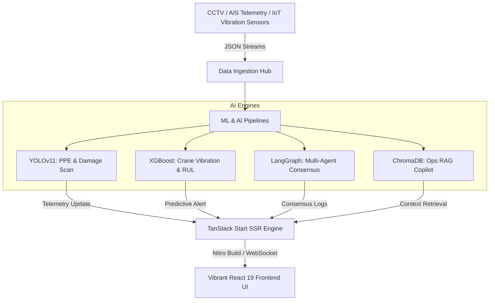

# Portmind AI — Real-Time Maritime & Logistics Intelligence Operating System

<div align="center">

**An ultra-responsive, real-time command, control, and multi-agent coordination system for modern maritime terminals and container logistics hubs.**

[](https://www.python.org/downloads/)
[](https://reactjs.org/)
[](https://vitejs.dev/)
[](https://fastapi.tiangolo.com/)
[](https://tailwindcss.com/)
[](https://tanstack.com/)

[Features](#-key-features--system-modules) • [Demo](#-ui-screenshots--demos) • [Installation](#%EF%B8%8F-installation--setup) • [Architecture](#-architecture--orchestration-mesh) • [API](#-api-endpoints)

</div>

---

## 🎯 System Overview

Portmind AI bridges the gap between raw physical telemetry and structured operator consensus. By integrating computer vision (YOLOv11), predictive modeling (XGBoost), agent coordination schemas (LangGraph), and semantic retrieval (ChromaDB RAG), Portmind AI converts real-time camera feeds, AIS telemetry, and crane IoT vibrations into millisecond-level decision flows. 

Whether preventing high-risk PPE violations, scheduling berth arrivals for massive cargo vessels, or resolving crane duty cycles through dynamic load sharing, Portmind AI provides operators with a unified, state-of-the-art terminal operating panel.

---

## 🖼️ UI Screenshots & Demos

<div align="center">

### 1. Command Center & Live Analytics
<!-- Add your screenshots/videos here -->
> *Placeholder: Add screenshot of Command Center*

### 2. Multi-Agent War Room & Digital Twin
<!-- Add your screenshots/videos here -->
> *Placeholder: Add screenshot of Digital Twin and War Room*

</div>

---

## 📦 Key Features & System Modules

### 📺 Command Center
* **Live Operational Metrics**: Continuous monitoring of Active Vessels, Daily Container Throughput, active Safety Alerts, and Fleet Crane Health.
* **Risk Score Matrix**: Auto-calculates Global Port Risk Score using a composite index of 47 live signals (Equipment health, safety rules, weather hazards).
* **Dynamic Event Streams**: Real-time auto-updating logs signaling yard OCR detection, berth arrivals, and maintenance warnings.

### 🗺️ Live 2D/3D Digital Twin Map
* **Interactive Spatial Layout**: Live tracking and coordinates of container blocks, gate lanes, berths, quay walls, and equipment.
* **Smart Heatmaps**: Toggleable visual layers showing yard fill percentage, queue congestions, and operational density.
* **Inspectable Entities**: Click to detail mechanical status, current cargo load, speed, and positioning details for cranes, vessels, and trucks.

### ⚔️ Multi-Agent Collaborative War Room
* **Autonomous Agent Mesh**: Features Marine Traffic, Yard Allocation, Crane Dispatch, and Gate Coordination agents communicating in a dynamic consensus loop.
* **Consensus DAG Visualizer**: Flow animations depicting active message passes and token coordination between micro-agents.
* **Conflict Arbitration Board**: Lists resolving/resolved operational bottlenecks.

### 📦 Container Intelligence
* **OCR Shipping Identification**: Alphanumeric scanning and registration of container IDs in real time.
* **Structural Scanning**: Structural integrity scanning for side impacts, container corrosion, or top-flange damage.
* **Yard Matrices**: Coordinates positioning maps to optimize crane stack allocation.

### 🏗️ Predictive Asset Maintenance
* **Remaining Useful Life (RUL)**: Live vibration sensors feed XGBoost models to evaluate mechanical wear.
* **Early Failure Alarms**: Automatically flags abnormal telemetry (e.g., crane vibration spike exceeding 4g threshold) and schedules service runs.

### 🛰️ Vessel Intelligence
* **Real-time AIS Telemetry**: Forecasts vessel ETA dynamically based on channel congestion and weather parameters.
* **Berth Optimization**: Algorithmic berthing allocation based on vessel size and crane dispatch workload.

### 🛡️ Safety & PPE Compliance
* **Vision Guardrails**: PPE detection scanning for helmet/vest compliance, hazardous zone breaches, and unauthorized entries.
* **Intrusion Mitigation**: Instantly alerts safety dispatchers and maps physical coordinates of infractions.

### 🧠 AI Copilot & Docs AI
* **Natural Language Operator**: RAG query hub parsing port rules, harbor operations handbook, and shipping protocols.
* **Action Automation**: Multi-agent orchestration maps operator questions to operational APIs.

---

## 🧩 Architecture & Orchestration Mesh



### Component Breakdown

```
┌─────────────────────────────────────────────────────────────┐
│                    Frontend (React + Vite)                   │
│  ┌──────────┐  ┌──────────┐  ┌──────────┐  ┌──────────┐   │
│  │ Dashboard│  │ Copilot  │  │ War Room │  │ Digital  │   │
│  │          │  │ (RAG)    │  │ (Agents) │  │   Twin   │   │
│  └──────────┘  └──────────┘  └──────────┘  └──────────┘   │
└─────────────────────────────────────────────────────────────┘
                            ↕ HTTP/WebSocket
┌─────────────────────────────────────────────────────────────┐
│                 Backend (FastAPI + Python)                   │
│  ┌──────────┐  ┌──────────┐  ┌──────────┐  ┌──────────┐   │
│  │ RAG API  │  │ Simulator│  │  Wagon   │  │ Document │   │
│  │ (Port 8001)│ (Port 8000)│  │ Detection│  │  Parser  │   │
│  └──────────┘  └──────────┘  └──────────┘  └──────────┘   │
└─────────────────────────────────────────────────────────────┘
                            ↕
┌─────────────────────────────────────────────────────────────┐
│                    AI Model Pipeline                         │
│  ┌──────────┐  ┌──────────┐  ┌──────────┐                 │
│  │ YOLOv11  │  │ XGBoost  │  │ Groq API │                 │
│  │ (Vision) │  │ (RUL)    │  │ (GenAI)  │                 │
│  └──────────┘  └──────────┘  └──────────┘                 │
└─────────────────────────────────────────────────────────────┘
```

---

## 🤖 AI Models & Technologies

| Model / Tech | Purpose | Usage / Framework |
|-------|---------|-----------|
| **YOLOv11** | Vision & OCR | PPE Detection, Wagon Number Extraction, Anomaly Detection |
| **XGBoost** | Predictive Maintenance | Crane Vibration analysis & Remaining Useful Life (RUL) |
| **ChromaDB** | Semantic Retrieval | RAG system for operational rulebooks |
| **Groq API** | AI Copilot | Ultra-fast natural language generation and RAG-based automated reporting using LLMs (e.g. gpt-oss-120b) |
| **LangGraph** | Agent Coordination | Multi-agent consensus for terminal logistics |
| **FastAPI** | Backend Engine | Microservices architecture |
| **React 19 & Vite** | Frontend Client | Ultra-responsive UI with SSR via TanStack Start |

---

## ⚙️ Installation & Setup

### Prerequisites

- **Node.js**: `v20.0.0` or higher
- **Python**: `3.8` or higher
- **NPM**: Package manager

### 1. Clone the Repository

```bash
git clone https://github.com/Aryanbuha890/Portmind-AI-Hacknomics.git
cd Portmind-AI-Hacknomics
```

### 2. Backend Setup

The backend consists of two primary services: the **Main API / Simulator** and the **RAG API**.

**Start the Main Simulator (Port 8000):**
```bash
cd Backend/what_if_simulator
pip install -r requirements.txt
python main.py
```

**Start the RAG API (Port 8001):**
Open a new terminal window:
```bash
cd Backend/RAG
pip install -r requirements.txt
python -m src.main serve
```

### 3. Frontend Setup

Open a new terminal window:
```bash
cd Frontend
npm install
npm run dev
```

*The frontend application will launch and be accessible at `http://localhost:5173` (or the port specified by Vite).*

---

## 📊 API Endpoints

### Core Analytics & Simulation (`localhost:8000`)
```http
POST /api/simulate        # Run full ML Monte Carlo simulation
POST /api/predict         # Fast ML prediction for scenario analysis
POST /api/weather         # Fetch real-time weather & run predictions
POST /api/docs-ai/parse   # Parse uploaded manifest PDFs/TXTs
```

### Video & AI Inspections (`localhost:8000`)
```http
POST /upload                                # Upload video for inspection
GET  /inspections/{inspection_id}/status    # Check processing status
GET  /history                               # Get all inspection records
GET  /history/{inspection_id}               # Get detailed wagon data
GET  /history/{inspection_id}/report        # Download HTML/PDF report
```

### RAG Assistant (`localhost:8001`)
```http
POST /ask                 # Query the RAG knowledge base for maritime protocols
```

---

## 📁 Project Directory Structure

```text
Portmind-AI-Hacknomics/
├── Backend/                            
│   ├── RAG/                            # Semantic search and Document retrieval service
│   ├── what_if_simulator/              # Main FastAPI backend, simulation & analytics
│   ├── wagon number detection/         # YOLO-based OCR computer vision models
│   └── PPE detection/                  # YOLOv11 Safety Guardrail models
├── Frontend/                           # React 19 + TanStack Start UI
│   ├── src/
│   │   ├── components/                 # Reusable UI components & Sidebars
│   │   ├── routes/                     # File-based routing (app.tsx, index.tsx, etc.)
│   │   ├── lib/                        # Utilities & API bindings
│   │   └── styles.css                  # Tailwind CSS styling
│   └── vite.config.ts                  # Vite configuration
└── README.md                           # Main developer documentation
```

---

## 📜 License & Contribution

This project is open-source. For contribution guidelines, please refer to the issues and pull requests tab on GitHub.

**Note**: First run of the AI modules (YOLO, Embeddings) may download models (~1-3GB) and could take a few minutes. Subsequent runs will be much faster as models are cached locally.
